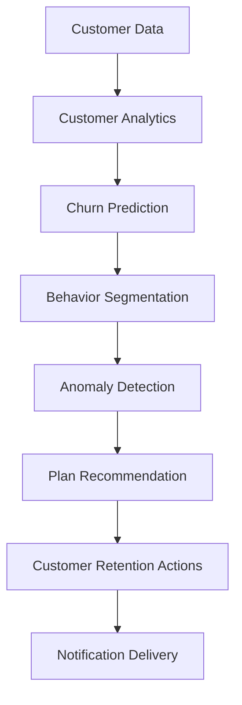

# TelecomAI – Telecom Customer Intelligence & Plan Recommendation Platform

## Overview

TelecomAI is an AI-powered telecom customer intelligence platform designed to help telecom providers improve customer retention and upselling opportunities through personalized mobile plan recommendations.

The platform analyzes customer behavior, predicts churn risk, segments users based on usage patterns, detects anomalies, and recommends the most suitable mobile plans using AI-driven analytics and microservices architecture.

---

## Problem Statement

Telecom providers often struggle to offer personalized plans that align with individual customer behavior and preferences. This can result in customer dissatisfaction, increased churn, and missed revenue opportunities.

TelecomAI addresses this challenge by providing intelligent customer insights and personalized plan recommendations based on customer usage patterns and engagement metrics.

---

## Key Features

### Customer Analytics

* Customer Management Dashboard
* Customer Usage Analytics
* Engagement Monitoring
* Behavioral Insights

### Churn Prediction

* Churn Risk Analysis
* Low / Medium / High Risk Classification
* Customer Retention Insights

### Customer Segmentation

* Heavy Users
* Data Users
* Casual Users
* Inactive Users

### Anomaly Detection

* Unusual Usage Pattern Detection
* Customer Activity Monitoring

### Plan Recommendation Engine

* Personalized Mobile Plan Recommendations
* Customer Behavior-Based Recommendations
* Recommendation Match Scoring

### Plan Management

* Telecom Plan Catalog Management
* CRUD Operations for Plans
* Dynamic Plan Updates

### Notification System

* Personalized Customer Notifications
* Automated Notifications on Plan Updates

### Authentication & Authorization

* JWT Authentication
* BCrypt Password Encryption
* Role-Based Access Control (ADMIN / USER)

---

## System Architecture

```text
React Frontend
       │
       ▼
Spring Boot Microservices
       │
       ▼
MySQL Database
       │
       ▼
FastAPI AI Services
```

### Microservices

* Auth Service
* User Service
* Plan Service
* Recommendation Service
* Notification Service
* Eureka Server

### AI Agents

* Churn Prediction Agent
* Recommendation Agent
* Behavior Segmentation Agent
* Intelligence Agent

---

## Project Workflow



---

## AI Modules

### Churn Prediction Agent

Uses XGBoost to predict customer churn probability based on:

* Data Usage
* Call Activity
* SMS Activity
* Complaints
* Payment History
* Customer Engagement

### Customer Segmentation Agent

Groups customers into:

* Heavy Users
* Data Users
* Casual Users
* Inactive Users

### Intelligence Agent

Provides:

* Engagement Score Calculation
* Anomaly Detection using Isolation Forest

### Recommendation Agent

Analyzes customer usage patterns and generates personalized mobile plan recommendations.

---

## Technology Stack

### Frontend

* ReactJS
* HTML
* CSS
* JavaScript

### Backend

* Java
* Spring Boot
* REST APIs
* Eureka Server
* JWT Authentication
* BCrypt Password Encryption

### AI & Analytics

* Python
* FastAPI
* Scikit-Learn
* XGBoost
* K-Nearest Neighbors (KNN)
* Isolation Forest

### Database

* MySQL

### Tools

* Maven
* Git
* GitHub
* IntelliJ IDEA
* VS Code
* MySQL Workbench
* Postman

---

## Core Modules

### Admin Dashboard

* Executive Overview
* Customer Analytics
* Retention Analytics
* Plan Optimization
* Customer Segments
* Customer Management
* Plan Catalog

### User Dashboard

* Current Plan Information
* Personalized Recommendations
* Plan Comparison
* Usage Analytics
* Notification Center

---

## Security Features

* JWT Authentication
* BCrypt Password Hashing
* Role-Based Access Control
* Secure REST API Communication

---

## Business Value

TelecomAI enables telecom providers to:

* Improve customer retention through proactive churn prediction
* Deliver personalized mobile plan recommendations
* Identify customer behavior patterns and segments
* Detect unusual customer activity
* Increase upselling opportunities
* Improve customer engagement and satisfaction

---

## Author

**Krrish Garg**

